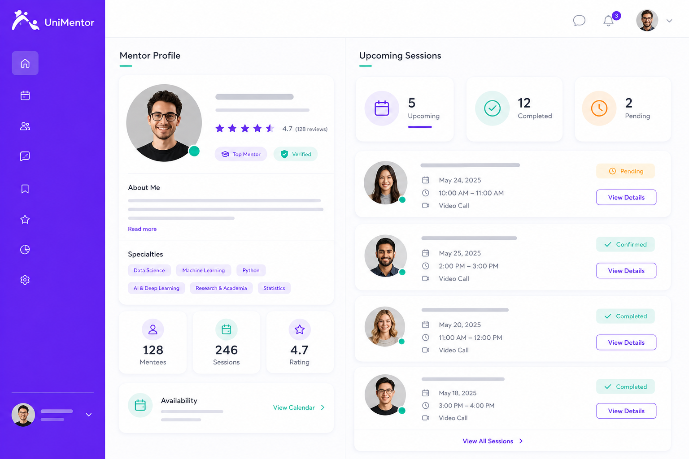

<div align="center">
  
  <h1>UniMentor</h1>
</div>

<p align="center">
  <strong>University Mentorship Marketplace</strong> — Connecting students with graduates for professional guidance.
</p>

<p align="center">
  
  
  
  
  
</p>

> 📄 Read this in: **English** | [Español](README.es.md)

---

## Table of Contents

- [What It Does](#what-it-does)
- [Stack](#stack)
- [Architecture](#architecture)
- [Installation](#installation)
- [Environment Variables](#environment-variables)
- [Project Structure](#project-structure)
- [License](#license)

---

## What It Does

UniMentor is an EdTech platform that connects university students with graduates who provide professional mentorship. Students receive career guidance while graduates share their experience and strengthen the university community.

**Product line:** Educational Platforms (EdTech) — Software Engineering II.

---

## Stack

| Layer | Technology |
|-------|-----------|
| **UI Framework** | React 19 |
| **Language** | TypeScript 5.8 |
| **Styling** | Tailwind CSS 4 |
| **Build Tool** | Vite 6 |
| **Backend / BaaS** | InsForge (Postgres, Auth, Storage) |

---

## Architecture

The project follows **Atomic Design** methodology, organizing UI components into four clearly separated layers:

```
src/
├── components/
│   ├── atoms/          # Primitive building blocks
│   ├── molecules/      # Composed UI units
│   ├── organisms/      # Complex feature components
│   └── screens/        # Full page views
├── services/           # Business logic and data access
├── hooks/              # Custom hooks
├── utils/              # Utility functions
├── types/              # TypeScript interfaces
├── backend/            # InsForge client
├── theme/              # Theme configuration
└── main.tsx            # App entry point
```

### Preview

| Landing Page | Mentor Search | Mentor Profile |
|:---:|:---:|:---:|
|  |  |  |

---

## Installation

### Prerequisites

- Node.js 18+ and npm
- An [InsForge](https://insforge.dev) account (free tier works)
- Git

### 1. Clone the repository

```bash
git clone https://github.com/AFB-9898/UniMentor.git
cd UniMentor
```

### 2. Install dependencies

```bash
npm install
```

### 3. Configure environment variables

Create a `.env` file in the project root (see [Environment Variables](#environment-variables)).

### 4. Run locally

```bash
npm run dev
```

Runs at `http://localhost:5173`

### 5. Build for production

```bash
npm run build    # Outputs to dist/
npm run preview  # Preview the production build locally
```

---

## Environment Variables

Create a `.env` file at the project root:

```env
VITE_INSFORGE_URL=https://your-project.insforge.dev
VITE_INSFORGE_PUBLISHABLE_KEY=sb_publishable_your-key-here
```

---

## Project Structure

```
UniMentor/
├── public/
│   └── favicon.png
├── docs/
│   ├── logo.png
│   ├── mockups/
│   │   ├── landing-page.png
│   │   ├── mentor-search.png
│   │   ├── mentor-profile.png
│   │   └── README.md
│   ├── componentes/
│   ├── arquitectura/
│   └── refactorizacion/
├── src/
│   ├── components/
│   │   ├── atoms/
│   │   ├── molecules/
│   │   ├── organisms/
│   │   └── screens/
│   ├── services/
│   ├── hooks/
│   ├── utils/
│   ├── types/
│   ├── backend/
│   ├── theme/
│   ├── App.tsx
│   ├── main.tsx
│   └── index.css
├── .env.example
├── .gitignore
├── index.html
├── LICENSE
├── package.json
├── vite.config.ts
├── tsconfig.json
├── tsconfig.app.json
├── tsconfig.node.json
└── README.md
```

---

## License

This project is licensed under the MIT License — see the [LICENSE](LICENSE) file for details.
