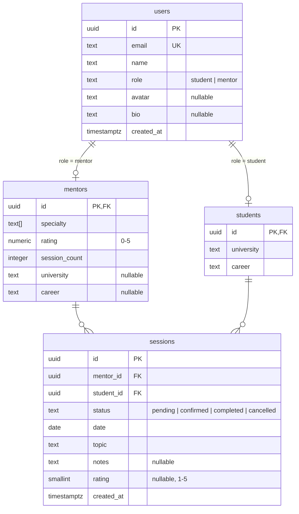
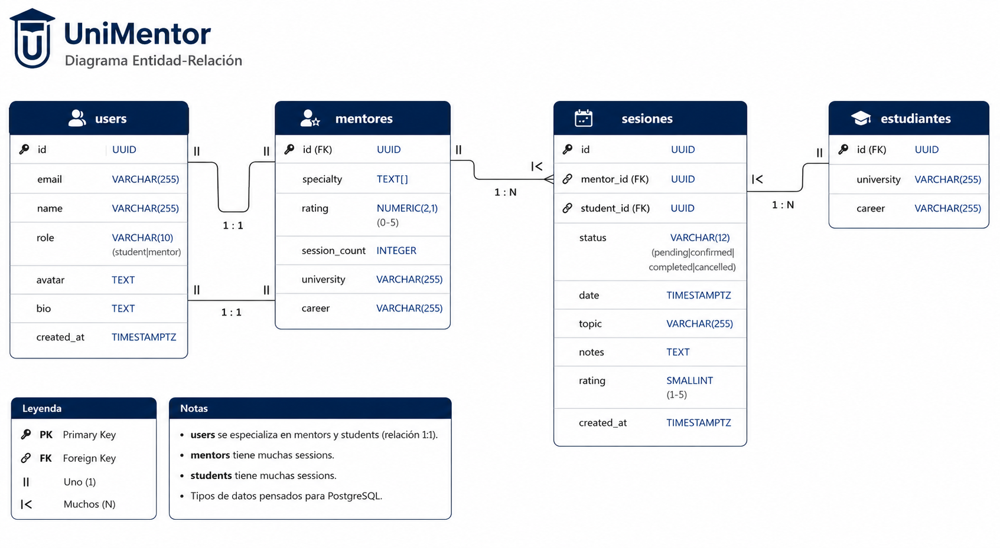

# UniMentor — Arquitectura de Datos

> Este documento define la arquitectura de la capa de datos: cómo el frontend se conecta con InsForge (BaaS), la capa de servicios, las tablas de la base de datos y los patrones de flujo de datos.

---

## Vista General de la Arquitectura

```text
┌─────────────────────────────────────────────────────────┐
│                    React Frontend                        │
│                                                         │
│  ┌──────────┐  ┌──────────────┐  ┌──────────────────┐  │
│  │ Screens  │→ │   Services   │→ │  InsForge Client  │  │
│  │ (pages)  │  │  (business)  │  │  (API calls)      │  │
│  └──────────┘  └──────────────┘  └────────┬─────────┘  │
│         ↑                                 │             │
│  ┌──────┴──────┐                          │             │
│  │ Components  │                          │             │
│  │(atoms/mol/  │                          │             │
│  │ organisms)  │                          │             │
│  └─────────────┘                          │             │
└───────────────────────────────────────────┼─────────────┘
                                            │
                                    ┌───────▼────────┐
                                    │   InsForge API   │
                                    │  (BaaS Gateway)  │
                                    └───────┬────────┘
                                            │
                            ┌───────────────┼───────────────┐
                            │               │               │
                      ┌─────▼─────┐  ┌──────▼──────┐  ┌────▼────┐
                      │ PostgreSQL │  │ InsForge    │  │InsForge │
                      │ (Database) │  │ Auth        │  │Storage  │
                      └───────────┘  └─────────────┘  └─────────┘
```

**Regla clave:** Los componentes NUNCA llaman a InsForge directamente. Se comunican con **servicios**, que usan el cliente de InsForge. Esto mantiene la UI desacoplada del backend.

---

## Capa de Servicios

Cada entidad de dominio tiene un servicio correspondiente que abstrae todo el acceso a datos. Los servicios devuelven Promises, así las pantallas quedan listas para operaciones asíncronas.

| Servicio            | Responsabilidad                                |
| ------------------- | ---------------------------------------------- |
| `mentorService`     | Listar mentores, obtener por ID, actualizar perfil |
| `studentService`    | Obtener/actualizar perfil de estudiante        |
| `sessionService`    | Crear sesión, actualizar estado, listar por usuario |
| `ratingService`     | Enviar calificación, obtener promedio           |
| `authService`       | Login, register, logout, obtener usuario actual |

### Patrón de Interfaz de Servicio

```typescript
// Cada servicio define una interfaz primero
export interface MentorService {
  list(filters?: MentorFilters): Promise<Mentor[]>;
  getById(id: string): Promise<Mentor | null>;
  updateProfile(id: string, data: Partial<Mentor>): Promise<Mentor>;
}
```

Una **implementación mock** se usa durante el desarrollo. Cuando InsForge esté listo, una **implementación real** la reemplaza — los componentes nunca cambian.

---

## Tablas de la Base de Datos (PostgreSQL via InsForge)

### `users`

Identidad base para todos los usuarios de la plataforma. Gestionado principalmente por InsForge Auth.

| Columna      | Tipo         | Restricciones               |
| ------------ | ------------ | --------------------------- |
| `id`         | `uuid`       | PK, default `gen_random_uuid()` |
| `email`      | `text`       | NOT NULL, UNIQUE             |
| `name`       | `text`       | NOT NULL                     |
| `role`       | `text`       | NOT NULL, CHECK (`'student'` o `'mentor'`) |
| `avatar`     | `text`       | nullable (URL de InsForge Storage) |
| `bio`        | `text`       | nullable                     |
| `created_at` | `timestamptz`| NOT NULL, default `NOW()`    |

### `mentors`

Datos específicos del perfil de mentor. Uno a uno con `users` (solo para rol = `'mentor'`).

| Columna          | Tipo         | Restricciones               |
| --------------- | ------------ | --------------------------- |
| `id`            | `uuid`       | PK, FK → `users.id` ON DELETE CASCADE |
| `specialty`     | `text[]`     | NOT NULL, default `[]`       |
| `rating`        | `numeric(2,1)` | NOT NULL, default `0`, CHECK (0–5) |
| `session_count` | `integer`    | NOT NULL, default `0`        |
| `university`    | `text`       | nullable                     |
| `career`        | `text`       | nullable                     |

### `students`

Datos específicos del perfil de estudiante. Uno a uno con `users` (solo para rol = `'student'`).

| Columna     | Tipo    | Restricciones               |
| ----------- | ------- | --------------------------- |
| `id`        | `uuid`  | PK, FK → `users.id` ON DELETE CASCADE |
| `university`| `text`  | NOT NULL                     |
| `career`    | `text`  | NOT NULL                     |

### `sessions`

Entidad central del negocio — una reserva de mentoría que vincula a un estudiante con un mentor.

| Columna      | Tipo          | Restricciones               |
| ------------ | ------------- | --------------------------- |
| `id`         | `uuid`        | PK, default `gen_random_uuid()` |
| `mentor_id`  | `uuid`        | NOT NULL, FK → `mentors.id` |
| `student_id` | `uuid`        | NOT NULL, FK → `students.id` |
| `status`     | `text`        | NOT NULL, CHECK (`'pending'`, `'confirmed'`, `'completed'`, `'cancelled'`) |
| `date`       | `date`        | NOT NULL                     |
| `topic`      | `text`        | NOT NULL                     |
| `notes`      | `text`        | nullable                     |
| `rating`     | `smallint`    | nullable, CHECK (1–5)        |
| `created_at` | `timestamptz` | NOT NULL, default `NOW()`    |

**Índices:**
- `idx_sessions_mentor_id` ON `sessions(mentor_id)`
- `idx_sessions_student_id` ON `sessions(student_id)`
- `idx_sessions_status` ON `sessions(status)`

---

## Relaciones entre Entidades





**Reglas de relación:**
- Un `user` tiene exactamente un perfil (`mentors` o `students`) según su rol.
- Un `mentor` puede tener muchas `sessions`.
- Un `student` puede tener muchas `sessions`.
- Una `session` pertenece exactamente a un `mentor` y un `student`.
- Una `session` puede tener opcionalmente un `rating` (se asigna cuando el estado pasa a `completed`).

---

## Flujo de Autenticación

```text
┌──────────┐     ┌──────────────┐     ┌────────────┐
│  Screen  │────→│  authService │────→│ InsForge   │
│ (Login)  │     │              │     │ Auth       │
└──────────┘     └──────┬───────┘     └─────┬──────┘
                        │                   │
                    ┌───▼─────────┐    ┌────▼──────┐
                    │ UserContext │    │  JWT Token │
                    │ (frontend)  │    │  (session) │
                    └─────────────┘    └───────────┘
```

1. El usuario envía credenciales → `authService.login(email, password)`
2. InsForge Auth valida → devuelve un JWT token + perfil de usuario
3. El token se almacena (memoria + httpOnly cookie recomendado)
4. `UserContext` provee el usuario actual a toda la app
5. Las rutas protegidas verifican `UserContext` antes de renderizar

---

## Patrón de Flujo de Datos

Toda operación de datos sigue el mismo patrón:

```text
Screen / Component
    │
    ▼
Llamada a servicio   (ej. mentorService.list({ specialty: "React" }))
    │
    ▼
Petición al cliente InsForge  (ej. GET /api/collections/mentors?filter=...)
    │
    ▼
InsForge API Gateway
    │
    ▼
Consulta PostgreSQL
    │
    ▼
Respuesta → Servicio → Componente (via state/context)
```

**Los estados de carga y error se manejan a nivel de servicio o hook**, no en componentes individuales.

---

## Documentos Relacionados

- [Modelo de Dominio](03-domain-model.es.md)
- [Arquitectura](05-architecture.es.md)
- [Stack Tecnológico](04-tech-stack.es.md)
- [Especificación Funcional](07-functional-specification.es.md)
