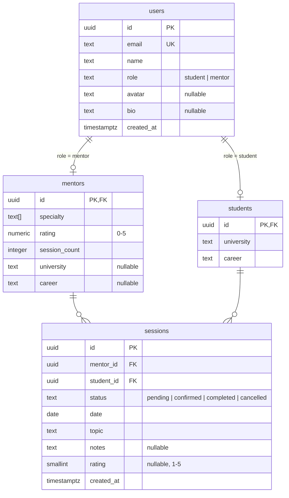

# UniMentor — Data Architecture

> This document defines the data layer architecture: how the frontend connects to InsForge (BaaS), the service layer, database tables, and data flow patterns.

---

## Architecture Overview

```text
┌─────────────────────────────────────────────────────────┐
│                    React Frontend                        │
│                                                         │
│  ┌──────────┐  ┌──────────────┐  ┌──────────────────┐  │
│  │ Screens  │→ │   Services   │→ │  InsForge Client  │  │
│  │ (pages)  │  │  (business)  │  │  (API calls)      │  │
│  └──────────┘  └──────────────┘  └────────┬─────────┘  │
│         ↑                                 │             │
│  ┌──────┴──────┐                          │             │
│  │ Components  │                          │             │
│  │(atoms/mol/  │                          │             │
│  │ organisms)  │                          │             │
│  └─────────────┘                          │             │
└───────────────────────────────────────────┼─────────────┘
                                            │
                                    ┌───────▼────────┐
                                    │   InsForge API   │
                                    │  (BaaS Gateway)  │
                                    └───────┬────────┘
                                            │
                            ┌───────────────┼───────────────┐
                            │               │               │
                      ┌─────▼─────┐  ┌──────▼──────┐  ┌────▼────┐
                      │ PostgreSQL │  │ InsForge    │  │InsForge │
                      │ (Database) │  │ Auth        │  │Storage  │
                      └───────────┘  └─────────────┘  └─────────┘
```

**Key rule:** Components must never call InsForge directly. They talk to **services**, which use the InsForge client. This keeps the UI decoupled from the backend.

---

## Service Layer

Each domain entity has a corresponding service that abstracts all data access. Services return Promises, so screens stay async-ready.

| Service              | Responsibility                                |
| -------------------- | --------------------------------------------- |
| `mentorService`      | List mentors, get by ID, update profile       |
| `studentService`     | Get/update student profile                    |
| `sessionService`     | Create session, update status, list by user   |
| `ratingService`      | Submit rating, get average                    |
| `authService`        | Login, register, logout, get current user     |

### Service Interface Pattern

```typescript
// Each service defines an interface first
export interface MentorService {
  list(filters?: MentorFilters): Promise<Mentor[]>;
  getById(id: string): Promise<Mentor | null>;
  updateProfile(id: string, data: Partial<Mentor>): Promise<Mentor>;
}
```

A **mock implementation** is used during development. When InsForge is ready, a **live implementation** replaces it — components never change.

---

## Database Tables (PostgreSQL via InsForge)

### `users`

Base identity for all platform users. Managed primarily through InsForge Auth.

| Column       | Type         | Constraints               |
| ------------ | ------------ | ------------------------- |
| `id`         | `uuid`       | PK, default `gen_random_uuid()` |
| `email`      | `text`       | NOT NULL, UNIQUE           |
| `name`       | `text`       | NOT NULL                   |
| `role`       | `text`       | NOT NULL, CHECK (`'student'` or `'mentor'`) |
| `avatar`     | `text`       | nullable (InsForge Storage URL) |
| `bio`        | `text`       | nullable                   |
| `created_at` | `timestamptz`| NOT NULL, default `NOW()`  |

### `mentors`

Mentor-specific profile data. One-to-one with `users` (only for role = `'mentor'`).

| Column          | Type         | Constraints               |
| --------------- | ------------ | ------------------------- |
| `id`            | `uuid`       | PK, FK → `users.id` ON DELETE CASCADE |
| `specialty`     | `text[]`     | NOT NULL, default `[]`     |
| `rating`        | `numeric(2,1)` | NOT NULL, default `0`, CHECK (0–5) |
| `session_count` | `integer`    | NOT NULL, default `0`      |
| `university`    | `text`       | nullable                   |
| `career`        | `text`       | nullable                   |

### `students`

Student-specific profile data. One-to-one with `users` (only for role = `'student'`).

| Column       | Type    | Constraints               |
| ------------ | ------- | ------------------------- |
| `id`         | `uuid`  | PK, FK → `users.id` ON DELETE CASCADE |
| `university` | `text`  | NOT NULL                   |
| `career`     | `text`  | NOT NULL                   |

### `sessions`

Core business entity — a mentorship booking linking a student and a mentor.

| Column       | Type          | Constraints               |
| ------------ | ------------- | ------------------------- |
| `id`         | `uuid`        | PK, default `gen_random_uuid()` |
| `mentor_id`  | `uuid`        | NOT NULL, FK → `mentors.id` |
| `student_id` | `uuid`        | NOT NULL, FK → `students.id` |
| `status`     | `text`        | NOT NULL, CHECK (`'pending'`, `'confirmed'`, `'completed'`, `'cancelled'`) |
| `date`       | `date`        | NOT NULL                   |
| `topic`      | `text`        | NOT NULL                   |
| `notes`      | `text`        | nullable                   |
| `rating`     | `smallint`    | nullable, CHECK (1–5)      |
| `created_at` | `timestamptz` | NOT NULL, default `NOW()`  |

**Indexes:**
- `idx_sessions_mentor_id` ON `sessions(mentor_id)`
- `idx_sessions_student_id` ON `sessions(student_id)`
- `idx_sessions_status` ON `sessions(status)`

---

## Entity Relationships



```text
users (base)
├── mentors (1:1) ──┐
│                   │
│     ┌─────────────┼──────────────────────┐
│     │             │                      │
│     │    sessions (N) ──── mentor_id     │
│     │    sessions (N) ──── student_id    │
│     │                                    │
│     └────────────────────────────────────┘
│
└── students (1:1) ─┘
```

**Relationship rules:**
- A `user` has exactly one profile row (`mentors` or `students`) depending on their role.
- A `mentor` can have many `sessions`.
- A `student` can have many `sessions`.
- A `session` belongs to exactly one `mentor` and one `student`.
- A `session` can optionally have a `rating` (set when status becomes `completed`).

---

## Authentication Flow

```text
┌──────────┐     ┌──────────────┐     ┌────────────┐
│  Screen  │────→│  authService │────→│ InsForge   │
│ (Login)  │     │              │     │ Auth       │
└──────────┘     └──────┬───────┘     └─────┬──────┘
                        │                   │
                    ┌───▼─────────┐    ┌────▼──────┐
                    │ UserContext │    │  JWT Token │
                    │ (frontend)  │    │  (session) │
                    └─────────────┘    └───────────┘
```

1. User submits credentials → `authService.login(email, password)`
2. InsForge Auth validates → returns a JWT token + user profile
3. Token is stored (memory + httpOnly cookie recommended)
4. `UserContext` provides current user to the entire app
5. Protected routes check `UserContext` before rendering

---

## Data Flow Pattern

Every data operation follows the same pattern:

```text
Screen / Component
    │
    ▼
Service function call   (e.g. mentorService.list({ specialty: "React" }))
    │
    ▼
InsForge client request  (e.g. GET /api/collections/mentors?filter=...)
    │
    ▼
InsForge API Gateway
    │
    ▼
PostgreSQL query
    │
    ▼
Response → Service → Component (via state/context)
```

**Loading & error states are handled at the service or hook level**, not in individual components.

---

## Related Documents

- [Domain Model](03-domain-model.md)
- [Architecture](05-architecture.md)
- [Tech Stack](04-tech-stack.md)
- [Functional Specification](07-functional-specification.md)
