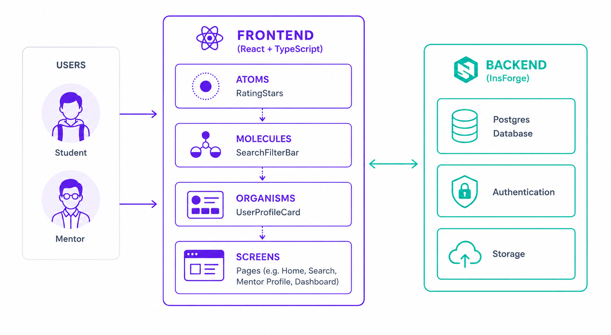

# Arquitectura — UniMentor

Diagrama general de la arquitectura del sistema y relación entre componentes.

## Diagrama de Arquitectura

### Capas

| Capa | Tecnología | Descripción |
|------|-----------|-------------|
| **Usuarios** | — | Estudiante (busca mentoría) y Mentor (ofrece mentoría) |
| **Frontend** | React + TypeScript | Atomic Design: Atoms → Molecules → Organisms → Screens |
| **Backend** | InsForge | Postgres Database, Authentication, Storage |
